En la entrada de hoy hablaremos:

- ¿Qué son los **Memory Leaks**?
- ¿Cómo se generan los memory leaks en una aplicación de iOS? 
- ¿Cómo detectarlos y cómo solucionarlos?

## ¿Qué son los Memory Leaks?

Este término seguramente ya lo has escuchado antes, y es que no está limitado solo a cuando estamos desarrollando aplicaciones en iOS. Un *Memory Leak* (o en español un "Fuga de memoria") sucede cuando un espacio en memoria no se pudo liberar.

Sin embargo, aún cuando sabemos que se deben evitar, nos hemos encontrado en algunos casos en que la aplicación empieza a consumir más memoria de lo que debería, a veces algunos *crashes* en las aplicaciones, etc.

Evidentemente debemos corregir estos issues. Y es aquí cuando a veces se empieza a complicar un poco la situación, porque dependiendo del tamaño de la aplicación y cómo esté el *codebase* puede ser tan simple o complejo el detectarlos.

*Swift* utiliza el *Automatic Reference Counting ([ARC](https://docs.swift.org/swift-book/LanguageGuide/AutomaticReferenceCounting.html))* que se encarga de la administración de memoria y así no delegarnos la responsabilidad a nosotros. El ARC (de una manera simple) lo podemos ver como un contador de referencias y que automáticamente libera la memoria usada por instancias una vez que este contador llega a cero. 

>  ARC will not deallocate an instance as long as at least one active reference to that instance still exists.

Para comprenderlo mejor, analicemos el siguiente caso: 

Representaremos a miembros de una familia; una madre y su hijo. Para ello creamos dos clases que representen a un padre o madre (Parent) y a un hijo (Child). Tengamos en cuenta que para nuestro caso, una madre puede tener solo un hijo y el hijo puede tener solo un padre o madre.
Para este ejemplo tenemos a una madre del tipo `Parent` llamada **mom** y a un hijo del tipo `Child` llamado **john**. 

Mom tiene un hijo que se llama John, y John tiene una madre que se llama Mom. Representemos esto en código.

```swift
class Child { 
    var parent: Parent?
}

class Parent { 
    var child: Child?
}

var john: Child? = Child()
var mom: Parent? = Parent()

john.parent = mom
mom.child = john

```

Tenemos dos variables, las cuales hacen referencia a dos objetos `Child` y `Parent`. En este momento el *ARC* tiene una referencia para el objeto `Child` y otra para el objeto `Parent`.

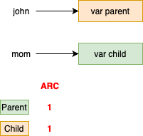

Cuando a `john` se le asigna a su variable `parent` la referencia de `mom`, el ARC incrementa en uno el contador de referencia de `Parent`. El estado quedaría de la siguiente manera:

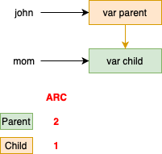

Lo mismo sucede cuando a `mom` se le asigna a su variable `child` la referencia de `john`, el contador de referencias de `Child` incrementa en uno. En este momento el estado quedaría de la siguiente manera:


Como podemos notar en el diagrama, existen dos referencias para ambos objetos. Dos de estas referencias son de los objectos `john` y `mom`, que son asignadas **en la creación de dichos objetos**. Las otras dos son referencias que se hacen por medio de las variables de los objetos `john` y `mom`.

Pero... ¿Qué sucedería si ahora la referencia de `john` y `mom` las hacemos `nil`? ¿Qué pasa con el *ARC*? 

```swift
john = nil
mom = nil
```

En este momento el estado del ARC es el siguiente:


Como podemos notar aún existen referencias hacia `Parent` y `Child`, pero una vez que perdimos las referencias de `john` y `mom`, no podemos "hacer nil" las referencias de `jhon.parent` ni `mom.child` porque perdimos el acceso a dichas instancias. Como resultado tenemos un Memory Leak.

Este caso es conocido como Ciclo de Retención (Retain Cycle). **Ciclo** porque ambas referencias apuntan entre si, generando un circulo de referencias de memoria. **Retención** porque las referencias a dichos objetos siguen en memoria.

### ¿Cómo comprobamos que realmente siguen dichas instancias en memoria? 

Una manera fácil de comprobar esto es agregar a cada clase, dentro del desinicializador (deinitializer) una simple línea **print** para observar en el log que realmente dichos desinicializadores nunca son llamados. Podemos correr nuestra aplicación iOS y observar en el log que nunca se muestran los mensajes de **print**.

```swift
class Child {
    var parent: Parent?

    deinit {
        print("Child deinit called")
    }
}

class Parent {
    var child: Child?

    deinit {
        print("Parent denit called")
    }
}
```
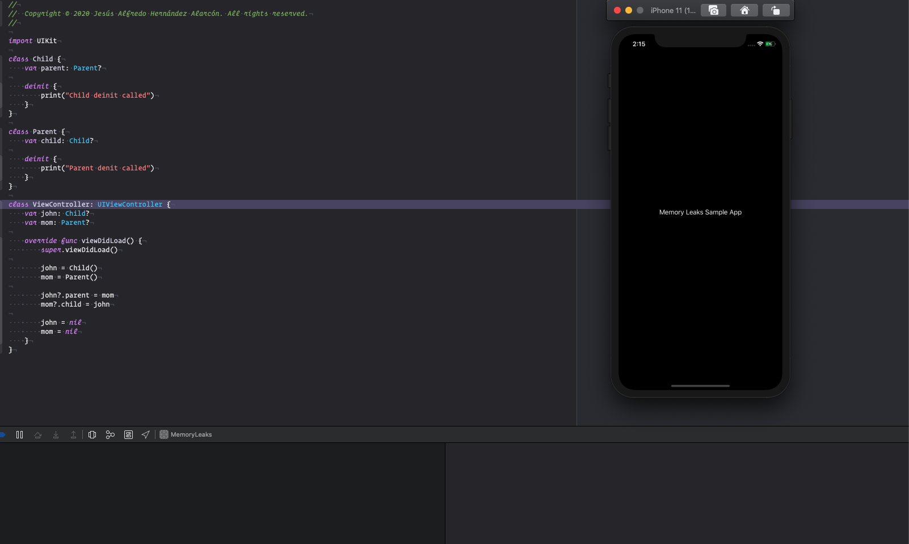

## Detectando Memory Leaks con Instruments

XCode nos proporciona una herramienta para poder detectar memory leaks, esta herramienta es Instruments. Y una de sus funciones es poder detectar memory leaks. Para ello vamos a nuestro proyecto en XCode y seleccionamos dentro el menú `Product` la opción de `Profile`. O simplemente con el shortcut **CMD + I**

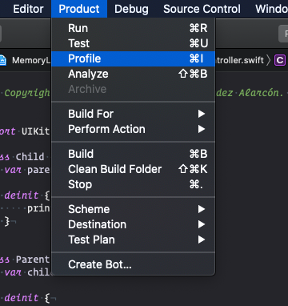

La aplicación empezará a compilarse nuevamente y al finalizar podemos ver que *Instruments* tiene diferentes opciones, por ahora nosotros estamos interesados en **Leaks**.

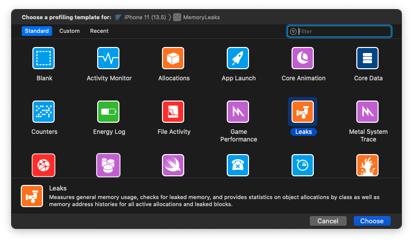

Una vez abierto Leaks, podemos ver que tenemos una linea de tiempo, donde podemos encontrar dos *instrumentos*: `Allocations` y `Leaks`. También tenemos en la parte superior un botón color rojo llamado `Record`, con el que podemos correr la aplicación y empezará a hacer un análisis de memory leaks. 

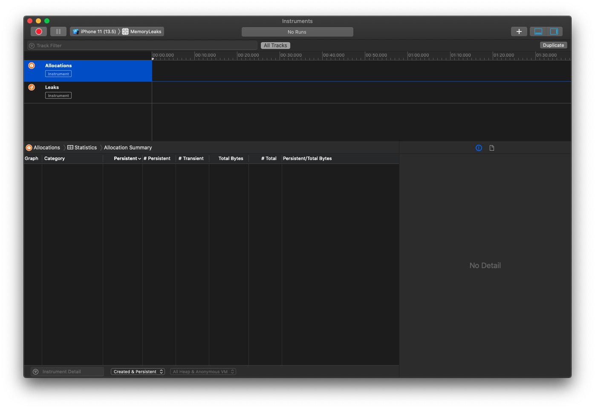

Seleccionamos un simulador en la parte superior de esta herramienta y presionamos el botón de **Record**.

En este momento la aplicación comienza a iniciar, y podemos ver que la línea de tiempo avanza. Podemos observar que dentro de *Allocations* tenemos cuanta memoria se está consumiendo, todas las alocaciones que existen en memoria, etc. Te invito a que le des un vistazo y observes toda la información que puedes obtener de dicho instrumento.

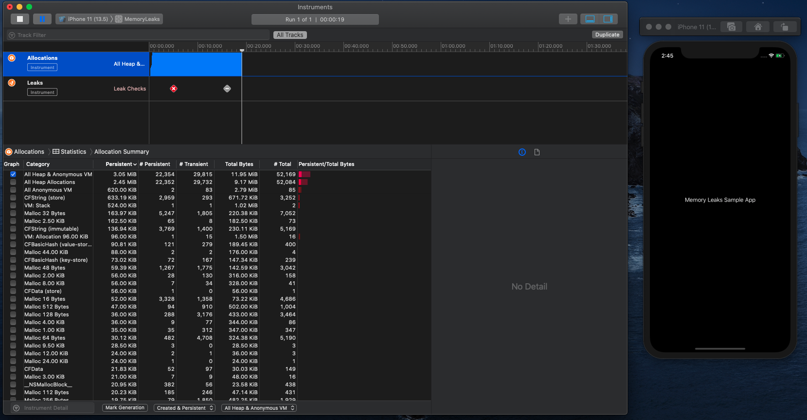

Y ahora la parte que nos interesa. Damos click en el instrumento de *Leaks*, y podemos observar que existen 2 memory leaks. Como podrás imaginar, estos dos "nuevos leaks" son los que se generaron debido al ciclo de retención entre `john` y `mom`. Podemos comprobarlo en la tabla inferior. Tenemos información de qué instancias estan aún en memoria. En nuestro caso son dos instancias, una de `Child` y otra de `Parent`. Tenemos también información de la dirección de memoria en la que está dicha instancia, el tamaño, etc. De igual manera te invito a revisar qué información extra puedes obtener.

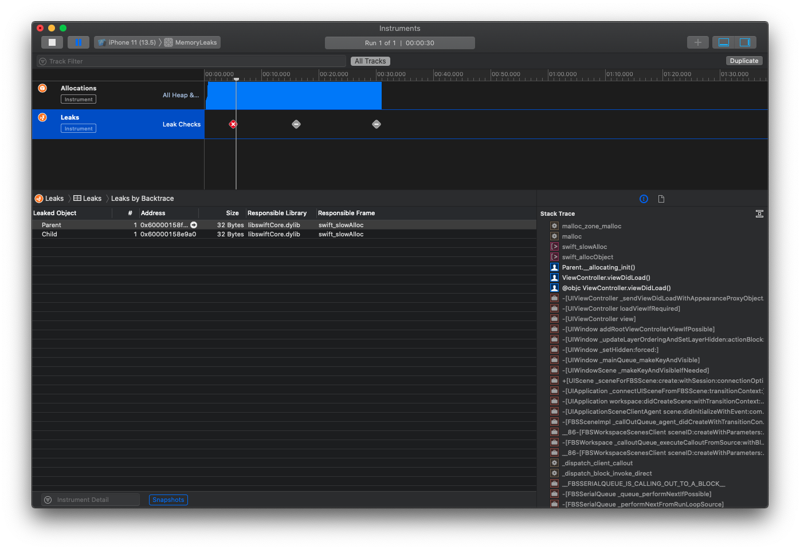

En el *timeline* (línea del tiempo) podemos observar que hay un símbolo en color gris con una línea blanca. Significa que no se generaron nuevos *leaks* durante el transcurso del tiempo. Esto es bueno, ya que hasta este estado de nuestra aplicación, ya no existen nuevos memory leaks generados. De igual manera una vez detectado el memory leak podemos pausar o detener la aplicación con los botones que se encuentran en la parte superior del timeline.

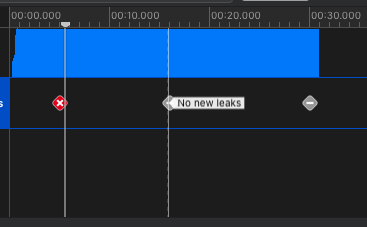

### Diagramas en Instruments

Así como al principio detallamos en un diagrama por qué las instancias siguen en memoria, instruments nos ayuda a generar dichos diagramas. Y para observar por qué se generó el memory leak, podemos seleccionar la opción **Cycles and Roots**, que la podemos encontrar dentro de *Leaks*.

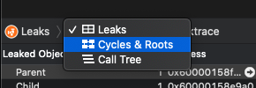

Claramente se observa que el memory leak se generó porque hay una referencia circular entre un objeto `Child` y un objeto `Parent`. Incluso nos muestra que `Child` por medio de la variable "*parent*", apunta a `Parent`, y que `Parent` por medio de la variable "*child*".

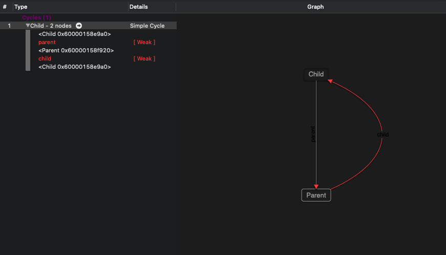

Recordemos que el *ARC* mantiene los contadores en uno de ambas instancias.

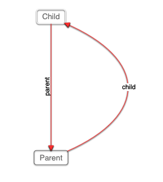

**TIP:** Si estas trabajando en equipo de testing y te tocó revisar algún bug que involucra algún memory leak, puedes guardar estos resultados para adjuntarlos como evidencia de dicho *issue*.

## ¿Cómo solucionar el memory leak?

Por defecto las referencias a clases en Swift son del tipo **strong** (referencia fuerte), por lo que cada clase hija se mantendrá "viva" en todo momento que la clase padre también lo esté.
Si la clase padre muere, como conscecuencia la clase hija también muere. Recordemos que cuando "mueren", los contadores de referencias de las clase padre e hija se decrementan en uno.


Así como existen referencias fuertes, también existen las referencias del tipo **weak** (referencia débil). Las referencias débiles **NO INCREMENTAN** el contador de referencias.
Y es así como solucionaremos el problema de memory leak. Para ello haremos lo siguiente.

1. Decidimos cuál de las clases debe ser considerada como la *clase hija*
2. Hacemos que la clase hija tenga una referencia del tipo débil con la clase padre.

En nuestro caso de ejemplo consideraremos a **john** que es del tipo `Child`, ser la clase hija y **mom** ser la clase padre.


Vamos a corregir nuestro código:

```swift 

class Child {
    weak var parent: Parent?

    deinit {
        print("Child deinit called")
    }
}

class Parent {
    var child: Child?

    deinit {
        print("Parent denit called")
    }
}
```

Para este caso, el diagrama antes de hacer nil a **mom** y a **john** es el siguiente:

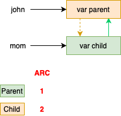

Si corremos nuestra aplicación de ejemplo, podemos ver que en la consola de logs nos imprime lo siguiente:

```
Parent denit called
Child deinit called
```

Podemos verificarlo con Instruments nuevamente, solo para asegurarnos que se liberó correctamente la memoria. Observamos que tenemos una palomita verde, en lugar de un tache rojo. No tenemos más memory leaks.

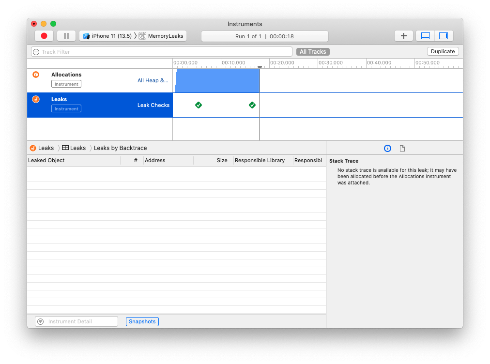

**TIP:** Podemos adjuntar como respuesta el archivo **.trace** de instruments como respuesta a el fix de el bug. 😎

Por supuesto hay más que explicar sobre los memory leaks y mas técnicas para detectarlos y corregirlos. Hablaremos de ello más adelante.

Happy coding!